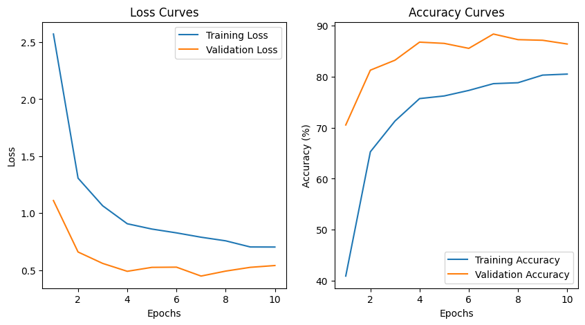
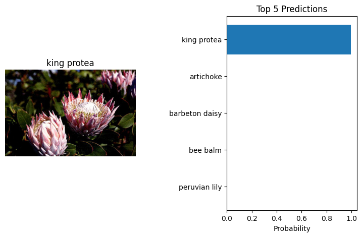

# Create Your Own Image Classifier

  

An AI-powered image classifier that recognizes different species of flowers using deep learning. The model is trained with *transfer learning* on the **Oxford 102 Flowers Dataset**, allowing it to predict flower species based on images.

## Project Overview

The project consists of two parts:

1. **Jupyter Notebook** – Train, evaluate, and test the model interactively.
2. **Command Line Interface (CLI)** – A script for predicting flower species directly from the terminal.

The classifier is built using **PyTorch** and leverages a pre-trained convolutional neural network (CNN), by default **VGG16**, for transfer learning.

## Dataset

The project uses the [**Oxford 102 Flowers Dataset**](http://www.robots.ox.ac.uk/~vgg/data/flowers/102/index.html). Example images:


## Installation and Requirements

### Install Dependencies

```sh
pip install torch torchvision keras numpy matplotlib pillow
```

to run the code interactively, install Jupyter Notebook:

```sh
pip install jupyter
```

### Clone the Repository

```sh
git clone https://github.com/sdtrklse/create-your-own-image-classifier.git
cd create-your-own-image-classifier
```

### Run Jupyter Notebook

```sh
jupyter notebook create-your-own-image-classifier.ipynb
```

## Usage

### Notebook Version

1. Open the Jupyter Notebook
2. Run all cells to train and evaluate the model
3. Test the model with new input images

### CLI Version

#### Train the model and save a checkpoint

Train a new network on a dataset with `train.py` that prints out training loss, training accuracy, validation loss, and validation accuracy as the network trains.

##### Basic usage for training

```sh
python train.py data_directory # (e.g., data_directory = "flowers")
```

##### Options for training

- Choose architecture
  
    ```sh
    python train.py data_dir --arch "vgg16"
    ```

- Set hyperparameters

    ```sh
    python train.py data_dir --hidden_units 512 --learning_rate 0.01 --epochs 20
    ```

- Use GPU for training

    ```sh
    python train.py data_dir --gpu
    ```

#### Run inference on new data

Predict flower name from an image with `predict.py` along with the probability of that name. That is, you'll pass in a single image `/path/to/image` and return the flower name and class probability.

##### Basic usage for prediction

```sh
python predict.py /path/to/image checkpoint # (e.g., /path/to/image = "image_05761.jpg")
```

##### Options for prediction

- Return top-k most likely classes

    ```sh
    python predict.py input checkpoint --top_k 3
    ```

- Use a mapping of categories to real names

    ```sh
    python predict.py input checkpoint --category_names cat_to_name.json
    ```

- Use GPU for inference

    ```sh
    python predict.py input checkpoint --gpu
    ```

## Model Architecture

The model uses *transfer learning* with a pre-trained CNN (e.g., VGG16) from torchvision as the feature extractor and a custom feedforward network as the classifier. The classifier layers are fine-tuned for flower classificationh and have the following architecture:

- **Feature Extractor**: Pre-trained **VGG16**
- **Custom Classifier**:
  - Fully-connected layers
  - ReLU activation
  - Softmax output (102 Classes)

## Performance Metrics

The loss and accuracy curves provide insights into the model's performance during training and evaluation.



## Example Results

The model successfully predicts flower species with high confidence, displaying the top predicted classes along with their probabilities.



## Future Improvements

There are possible enhancements to improve the model's performance and usability. Here are some ideas:

- Improve model accuracy with better tuning
- Deploy as a web app (Flask, FastAPI, Streamlit)
- Convert to mobile app (TensorFlow Lite, PyTorch Mobile)
- Optimize for speed (pruning, quantization)

## License

This project is open-source under the **MIT License**.
